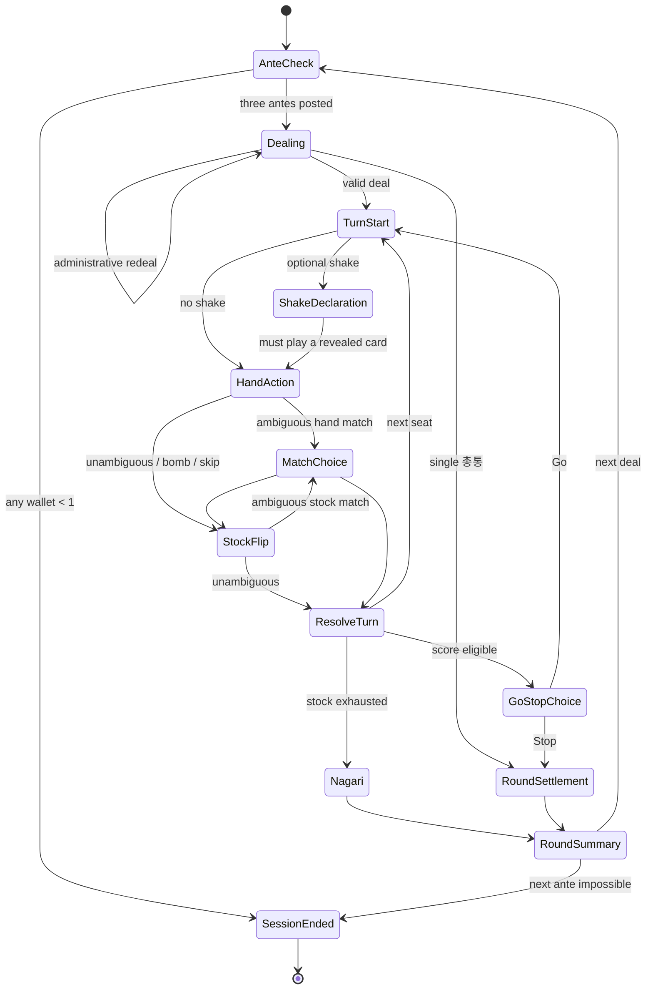

# Go-Stop Mobile: Three-Player MVP Implementation Plan

**Status:** implementation-ready proposal  
**Rules version:** `mvp-1`  
**Prepared:** 2026-08-11  
**Workspace finding:** the repository is empty apart from Git metadata, so this is a greenfield architecture. No existing code or design system needs to be preserved.

## 1. Executive summary

Build a cross-platform iOS/Android game with one deterministic TypeScript engine shared by three controllers:

1. Three humans using pass-and-play on one device.
2. One human playing two non-cheating AI opponents.
3. Three guests playing from separate devices through invite-only room codes.

Use an Expo/React Native mobile app and a small Cloudflare Worker with one Durable Object per online room. “No backend” cannot literally apply to reliable separate-device play: concealed hands, room discovery, authoritative turns, reconnection, and host loss require a deployed coordinator. For this MVP it means no accounts, matchmaking, profile database, permanent balance, chat, or long-term history. Online room data exists only long enough to run and recover an invited session.

Every new session has exactly 150 non-redeemable play chips: 50 per seat. Each playable deal begins with a one-chip ante from every player. The central pot uses the documented optional **Catching the Boar** variant: whoever captures the July animal card wins the current pot, even if another player ultimately wins the Go-Stop deal. Normal winner payments are separate and are capped by each payer's wallet.

The critical architectural decision is to make `packages/game-core` a pure deterministic reducer. The mobile UI, AI, and online relay may submit commands, but none may implement or mutate rules independently. All scores, legal actions, chip transfers, player-specific views, and replay results derive from this package.

### Fixed product assumptions

- Chips have no cash value, cannot be bought, sold, transferred outside a session, or cashed out.
- Every fresh session resets all three seats to 50 chips.
- Exactly three funded seats are required. The session ends when any seat cannot ante the next deal; it does not convert to two-player Matgo.
- Rebuys, accounts, matchmaking, rankings, persistent balances, spectators, chat, and monetization are deferred.
- The 48-card core deck is used. Extra manufacturer jokers/bonus-pi cards are documented but excluded from `mvp-1`.
- Korean and English ship together. Korean terms are canonical; concise English explanations accompany them.
- Gameplay is optimized for landscape phones and tablets. Setup, lobby, rules, and summary screens remain responsive in both orientations.
- OS-kill recovery is allowed only for human-vs-AI sessions, where no other human's concealed hand is at risk; exclude the snapshot from cloud backup and delete it when the session ends. Pass-and-play state remains memory-only and is lost if the process is killed. This is recovery, not a persistent balance.
- Online sessions use guest display names only and collect no email, phone number, contact list, or location.

## 2. Research findings and source policy

There is no national governing rules code for Go-Stop. The stable core is well established, while deal exceptions, bonus cards, multipliers, and side-payments vary by household, region, and commercial platform. The plan therefore freezes a named `mvp-1` rules profile and labels variants instead of claiming an “official” rulebook.

Primary practical references:

- [Pagat's Go-Stop rules](https://www.pagat.com/fishing/gostop.html) are the most complete comparative rules source found and explicitly distinguish variants. The page was updated August 1, 2026.
- [Korea.net's Go-Stop overview](https://www.korea.net/NewsFocus/HonoraryReporters/view?articleId=190228) corroborates the cultural context, two-to-three-player format, counterclockwise play, and Go/Stop premise. It is government-hosted but is an Honorary Reporter article, not a regulatory rules code.
- The [National Folk Museum of Korea publication](https://www.nfm.go.kr/_Upload/BALGANBOOK/817/sesi01.pdf) is useful for cultural and card-set background, not a detailed executable rule set.
- [WING Board Game's Korean rules summary](https://www.wingboardgame.com/2022/01/go-stop.html) corroborates common Korean setup, scoring, 50-chip play, and special moves.
- The commercial [Pmang Go-Stop guide](https://board-static.pmang.com/images/pmang/nabi/html/guide/gostop/gostop_2_1.html), its [special-capture guide](https://board-static.pmang.com/images/pmang/nabi/html/guide/gostop/gostop_2_2.html), [scoring guide](https://board-static.pmang.com/images/pmang/nabi/html/guide/gostop/gostop_2_3.html), and [settlement guide](https://board-static.pmang.com/images/pmang/nabi/html/guide/gostop/gostop_2_5.html) provide a mainstream Korean digital implementation. They are authoritative for Pmang, not for every household.
- [Fuda Wiki's Go-Stop compendium](https://fudawiki.org/en/hanafuda/games/go-stop) provides useful corroboration and variation detail.

Where sources conflict, `mvp-1` selects the behavior that is deterministic, familiar in mainstream Korean digital implementations, and tractable on mobile. All such choices appear below.

### Selected versus deferred rules

| Area | `mvp-1` decision | Reason |
|---|---|---|
| Players | Exactly 3 | Requested scope |
| Core deck | 48 cards, no added jokers | Stable common core; avoids deck-specific bonus behavior |
| Deal | 7 cards per player, 6 face-up, 21 stock | Corroborated by Pagat and Korean rules summaries |
| Stop threshold | 3 base points | Normal three-player threshold |
| Direction | Counterclockwise; dealer first | Common three-player convention |
| Core special captures | Include 쪽, 따닥, 뻑, 자뻑, 쓸 | Strategically central and well documented |
| 폭탄 / 흔들기 | Include both, mutually exclusive for the same triplet | Familiar and implementable |
| 피박 / 광박 | Include | Mainstream payer-specific penalties |
| 멍따 | Include global ×2 at 7+ animals | Avoids also applying the conflicting payer-specific 멍박 variant |
| 고박 | Include as liability reassignment | Central risk of saying Go in three-player play |
| 나가리 | Include, next-deal multiplier capped at ×8 | Mainstream digital behavior; bounds volatility |
| 총통 | One holder gets immediate 3-point win; multiple holders cause administrative redeal | Deterministic single-winner adaptation |
| Central pot | Optional-source Boar Pot made mandatory for this product | Directly satisfies requested ante system |
| Bonus pi/jokers | Defer | Manufacturer/platform behavior is not standardized |
| 외면, 쇼당, 띠박, payer-specific 멍박 | Defer | Hard-to-verify or regional variants |
| First-turn cash awards, three-뻑 auto-win, missions, VIP, 광팔기 | Defer | Side economies or player counts outside the MVP |

## 3. Deterministic `mvp-1` rules specification

### 3.1 Card catalog

The core Hwatu deck has four unique cards for each of 12 months: 5 brights (`광`), 9 animals (`열끗`), 10 ribbons (`띠`), and 24 junk cards (`피`). Captures match by **month**, never by scoring category. Pagat documents this composition and the scoring categories in detail.

| Month | Motif | Scoring cards in the month |
|---:|---|---|
| 1 | Pine | bright, red-poetry ribbon, 2 pi |
| 2 | Plum | bird animal, red-poetry ribbon, 2 pi |
| 3 | Cherry | bright, red-poetry ribbon, 2 pi |
| 4 | Wisteria | bird animal, plain-red ribbon, 2 pi |
| 5 | Iris | animal, plain-red ribbon, 2 pi |
| 6 | Peony | animal, blue ribbon, 2 pi |
| 7 | Bush clover | **boar animal**, plain-red ribbon, 2 pi |
| 8 | Pampas | bright, bird animal, 2 pi |
| 9 | Chrysanthemum | cup animal/flexible double-pi, blue ribbon, 2 pi |
| 10 | Maple | animal, blue ribbon, 2 pi |
| 11 | Paulownia | bright, 2 ordinary pi, 1 colored double-pi |
| 12 | Willow/rain | rain bright, animal, ribbon, double-pi |

Each card has an immutable `CardId`, `month`, printed category, tags, and `piValue`. The September cup is printed as an animal but may count as either one animal or two pi for scoring, never both. For Go/Stop eligibility, use the allocation producing the higher base score. If both allocations tie, keep both candidates: a stopping winner uses the candidate producing the higher total nominal payout, while each loser uses the candidate producing their lower own slot liability (including avoiding `피박`); remaining ties select animal. The allocation may change on a later turn as the capture set changes. For pi-surrender effects, the cup remains an animal and cannot be surrendered as pi. These automatic role-aware tie-breaks replace an interrupting manual choice and follow the defensive behavior seen in Pmang.

### 3.2 Session and dealer

1. Create exactly three seats with 50 chips each.
2. Randomly select the first dealer using cryptographically secure randomness.
3. Before a playable deal, atomically collect one chip from all three wallets into the central pot.
4. Deal and play counterclockwise. The dealer acts first.
5. The winner becomes dealer for the next deal.
6. After a `나가리`, the same dealer deals again.
7. A player who reaches zero may finish the already-anted deal. Before the next deal, if any player has fewer than one chip, end the session.

### 3.3 Deal

- Deal 4 cards to each seat, 3 face-up to the table, then 3 to each seat and 3 more to the table.
- Result: 7 cards in each hand, 6 on the table, 21 in the face-down stock.
- Hands and stock are private. Table cards, captured cards, chip balances, scores, Go counts, multipliers, and pot are public.
- If all four cards of a month are initially on the table, the deal attempt is administratively void: reshuffle with the same dealer, keep the already-posted ante, add no ante, and do not increment `nagariStreak`.
- If three cards of one month are initially on the table, store them as a locked three-card stack capturable by the fourth.
- If exactly one player is dealt all four cards of a month (`총통`), that player immediately wins a 3-point Stop result. No Go, shake, bomb, or bak multiplier applies; a carried `나가리` multiplier still applies. The boar is not considered captured merely because it is in the hand.
- If two or three players simultaneously hold a `총통`, administratively redeal with no additional ante. This replaces conflicting multi-winner payment variants with one deterministic product rule.

### 3.4 Turn state machine

A normal turn is strictly sequential:

1. `TURN_START`
2. Optional valid `DECLARE_SHAKE`; if declared, continue to a constrained `PLAY_HAND_CARD` using one revealed triplet card
3. If no shake was declared, choose `PLAY_HAND_CARD`, `PLAY_BOMB`, or use one `SKIP_HAND_CREDIT`
4. If the hand card has two loose table matches, `CHOOSE_HAND_MATCH`
5. Resolve the hand placement provisionally
6. `FLIP_STOCK_CARD`
7. If the stock card has two loose matches, `CHOOSE_STOCK_MATCH`
8. Resolve captures, locked stacks, and special events
9. Apply pi-surrender effects in stable seat order
10. Recompute the current player's base score
11. If eligible, `CHOOSE_GO_OR_STOP`; otherwise advance counterclockwise
12. If the stock is exhausted without Stop, end as `NAGARI`

Only the current pending-choice owner may act. A rejected command makes no state change and consumes no turn.



### 3.5 Matching and capture resolution

For a played hand card or stock flip, inspect table cards of the same month:

- **Zero matches:** place the card loose on the table.
- **One loose match:** form a provisional pair. It is normally captured after the stock flip is resolved.
- **Two loose matches:** the acting player chooses which one to pair with. The unchosen card remains unless `따닥` occurs.
- **One locked three-card stack:** the fourth card captures all four immediately.

Additional sequencing rules:

- If the hand play formed a pair and the stock flip is a different month, resolve the stock normally and capture the hand pair.
- If the hand play formed a pair and the stock flip is the same month, the three cards remain as a locked `뻑` stack; nothing from that month is captured on that turn.
- Exception on the final stock draw: if this sequence would create a new locked `뻑` that can no longer be captured, the acting player instead takes those three cards as an ordinary forced final capture. It creates no stack and earns no pi-surrender bonus.
- If two same-month cards were loose on the table and the hand card and stock card supply the remaining two cards, capture all four as `따닥`.
- If the hand card matched nothing and the stock flip matches the just-played hand card, capture that pair as `쪽`.
- A single turn can capture both the hand pair and a separate stock pair.
- Table stacks retain `createdBySeatId` so a later capture can distinguish ordinary `뻑` from `자뻑`.

### 3.6 Special events

#### 쪽 (`jjok`)

The hand card matched nothing, then the stock flip matches that newly placed card. Capture both and take one pi card from each opponent.

#### 따닥 (`ttadak`)

Two cards of a month were loose on the table; the hand card and stock flip are the other two. Capture all four and take one pi card from each opponent.

#### 쓸 / 싹쓸이 (`sweep`)

After all ordinary turn resolution, the table is empty. Take one pi card from each opponent.

#### 뻑 and 자뻑 (`ppeok/ppuk`, self-ppeok)

A hand-floor pair plus a same-month stock card becomes a locked three-card stack. Capturing any such stack later takes one pi card from each opponent. If the capturer originally created that stack, take two pi cards from each opponent instead.

First-turn chip awards, consecutive-뻑 awards, and a three-뻑 automatic win are disabled.

#### 폭탄 (`bomb`)

If a player holds three cards of a month and the fourth is loose on the table, they may play all three together, capture all four, take one pi card from each opponent, and gain two `skipHandCredits`. On each later turn, the player may spend one credit to skip the hand play and proceed directly to the stock flip. Each completed bomb contributes one ×2 winner-side multiplier if that player ultimately wins.

Bombing is optional. A triplet used for a bomb cannot also be declared as a shake.

#### 흔들기 (`shake`)

At the start of a turn, a player holding three same-month cards may reveal them and must play one of those three on that turn. Each valid declaration contributes one ×2 winner-side multiplier if the declarer wins. A triplet already declared as a shake cannot later be bombed.

#### Pi surrender

At the end of a turn, aggregate the pi-surrender units earned from all qualifying events for each opponent. To remove interrupting choice screens and keep pass-and-play private, `mvp-1` automatically selects a subset of that opponent's captured physical pi cards:

1. Prefer a subset whose total `piValue` meets the requested units with the least effective pi surrendered.
2. If several subsets surrender the same value, prefer fewer physical cards, then stable ascending `CardId` order.
3. If the opponent has less effective pi than requested, surrender every eligible pi card.
4. If no eligible pi card exists, surrender nothing.

Thus one ordinary pi satisfies one unit, while a double-pi may satisfy two units or may be surrendered for a one-unit request only when no ordinary pi is available. Distinct events stack: a qualifying `따닥` that also clears the table requests two units per opponent. On the final stock draw, suppress `쪽`, `따닥`, and sweep surrender bonuses because the last matches are forced. A final capture of a locked `뻑` stack still earns its surrender effect. This follows the common final-turn distinction documented by Pagat; automatic subset selection is an explicit mobile-product simplification and is test-covered.

### 3.7 Base scoring

Named combinations and category-count scores are additive.

#### Brights (`광`)

| Captured set | Points |
|---|---:|
| Fewer than 3 | 0 |
| 3 without rain bright | 3 |
| 3 including rain bright | 2 |
| Any 4 | 4 |
| All 5 | 15 |

#### Animals (`열끗`)

- 5 animals: 1 point.
- Each animal beyond 5: +1 point.
- February, April, and August birds (`고도리`): +5 points.
- 7 or more animals activates one global ×2 `멍따` settlement multiplier if the player wins.

#### Ribbons (`띠`)

- 5 ribbons: 1 point.
- Each ribbon beyond 5: +1 point.
- January-February-March red poetry ribbons (`홍단`): +3.
- June-September-October blue ribbons (`청단`): +3.
- April-May-July plain-red ribbons (`초단`): +3.
- The December rain ribbon is not part of a three-ribbon bonus set.

#### Pi (`피`)

- 10 effective pi: 1 point.
- Each effective pi beyond 10: +1 point.
- November colored pi and December rain pi count as two each.
- The September cup may instead count as two pi under the deterministic, role-aware allocation rule in section 3.1.

### 3.8 Go, Stop, and round end

- At the end of a completed turn, a player with at least 3 base points becomes eligible to choose Go or Stop.
- Stop ends the deal immediately; that player is the sole Go-Stop winner.
- Go increments `goCount` and records the current **base** score in `scoreAtLastGo`.
- After saying Go, the player gets another choice only after a later completed turn produces a base score strictly greater than `scoreAtLastGo`.
- A different player may Stop with a lower score than an earlier Go caller. Scores are not compared to choose the winner.
- If the stock is exhausted and no player Stops, the result is `나가리`: no point settlement, same dealer, and `nagariStreak` increments for the next deal.
- Consecutive `나가리` multipliers stack but cap at ×8 (`nagariStreak` capped at 3 for payment purposes). A normal win resets the streak to zero.
- Administrative redeals are not `나가리` and do not change the streak.

## 4. Chip economy and settlement

### 4.1 Traditional payment versus the product pot

In ordinary Go-Stop settlement, each loser pays the winner according to the winner's payable score; losers' scores do not offset the amount. Pagat and WING both describe direct loser-to-winner chip payment.

A central ante is not universal core Go-Stop. Pagat and Fuda Wiki document it as an optional **Catching the Boar** variation: all players contribute equally at the beginning of a deal, the player who captures the July animal wins the pot, and an unclaimed pot carries forward. This is the source-backed basis for the requested product economy and must be labeled “Boar Pot house rule” in the in-app rules.

### 4.2 Boar Pot rules

1. Before each playable deal, require all wallets to contain at least one chip.
2. Atomically subtract one from every wallet and add three to the pot and contribution ledger.
3. The first capture of the July boar animal immediately transfers the entire pot to its capturer and clears the contribution ledger.
4. The boar capturer need not be the eventual Go-Stop winner.
5. A boar award remains valid if the deal later ends in `나가리`.
6. If Stop or `나가리` occurs before the boar is captured, the pot carries to the next deal and receives the next three antes.
7. An administrative redeal uses the already-posted ante and cannot award or grow the pot.
8. If the session ends with an unclaimed pot, refund each seat exactly the number of chips recorded in `potContributionBySeat`, then set the pot to zero. The refund is final accounting and does not restart an ended session.

Awarding the pot at the capture event means a losing boar capturer may use those chips to cover later point liability. It also produces the clearest UI and event log.

### 4.3 Payable-score formula

Pmang's mainstream digital convention is selected because it is internally explicit: each Go adds one point, and doubling begins at 3-Go.

For winner `W`:

```text
goAdjustedScore = baseJokboScore + W.goCount

globalExponent =
    max(0, W.goCount - 2)          // 3-Go ×2, 4-Go ×4, ...
  + W.declaredShakes.length        // each successful shake ×2
  + W.completedBombCount           // each completed bomb ×2
  + (W.effectiveAnimals >= 7 ? 1 : 0) // 멍따 ×2
  + min(nagariStreakEnteringDeal, 3)  // prior draws, capped at ×8

commonLiability = goAdjustedScore × 2^globalExponent
```

This formula is a versioned rules decision because household sources differ on whether early Go additions remain in 3-Go-and-higher calculations and whether a bomb multiplies payment.

### 4.4 Loser-specific bak penalties

Calculate each loser's slot independently:

```text
gwangBak(loser) =
  winner has a scoring bright combination
  AND loser captured zero bright cards

piBak(loser) =
  winner scored at least one base point from pi
  AND loser has between 1 and 5 effective pi inclusive

slotLiability(loser) =
  commonLiability
  × (gwangBak(loser) ? 2 : 1)
  × (piBak(loser) ? 2 : 1)
```

Before testing `piBak(loser)`, apply the loser's September-cup allocation that minimizes that slot liability; this lets the flexible cup become two pi when doing so avoids `피박`. Zero pi is exempt from `피박` in `mvp-1`, following the selected Pmang convention, but the loser still owes ordinary liability. `광박` and `피박` may stack. `멍따` is already winner-global; do not also apply a payer-specific `멍박`. `띠박` is disabled.

### 4.5 Go-bak (`고박`)

Go-bak reassigns debt; it is not a generic multiplier.

1. First calculate both loser slots, including each slot's own bak status.
2. Find losing players who previously called Go in this deal.
3. If at least one exists, the earliest still-losing Go caller becomes the responsible payer.
4. Assign the sum of both slot liabilities to that payer; the other loser owes zero.
5. If the responsible payer cannot cover the combined debt, only that payer's remaining chips transfer. Do not fall back to the exempt loser.

The earliest-caller tie-break is an explicit `mvp-1` selection for the rare case in which both losers called Go.

### 4.6 Limited liability and ordering

Normal settlement occurs only after any same-turn boar capture has already paid out.

```text
actualPaid[payer] = min(wallet[payer], assignedLiability[payer])
wallet[payer] -= actualPaid[payer]
wallet[winner] += actualPaid[payer]
shortfall = assignedLiability[payer] - actualPaid[payer]
```

- Balances never go below zero.
- Shortfall is forgiven immediately; no debt or side pot persists.
- Process payers in stable seat order for reproducible logs, though both owe the same single winner and therefore need no pro-rata allocation.
- The winner receives actual paid chips, not theoretical liability.
- A player at zero remains in the just-completed deal's results but is marked unable to ante next deal.
- At the next boundary, refund any unclaimed pot, end the session, and rank seats by final wallet. A tie remains a shared rank; it is not broken artificially.

### 4.7 Settlement pseudocode

```ts
function beginDeal(session: SessionState): BeginDealResult {
  assertChipInvariant(session);

  if (session.seats.some((seat) => seat.chips < 1)) {
    refundUnclaimedPotByContribution(session);
    return endSession("PLAYER_CANNOT_ANTE");
  }

  for (const seat of stableSeatOrder(session.seats)) {
    seat.chips -= 1;
    session.pot += 1;
    session.potContributionBySeat[seat.id] += 1;
  }

  session.antePostedForDeal = true;
  assertChipInvariant(session);
  return dealCards();
}

function onBoarCaptured(session: SessionState, capturer: SeatId): DomainEvent {
  const award = session.pot;
  session.seats[capturer].chips += award;
  session.pot = 0;
  clearContributionLedger(session);
  assertChipInvariant(session);
  return { type: "BOAR_POT_AWARDED", capturer, award };
}

function settlePointWin(session: SessionState, result: WinResult): Settlement {
  assert(
    result.boarCapturer === undefined ||
      (session.pot === 0 && sum(Object.values(session.potContributionBySeat)) === 0)
  ); // a captured boar must be paid before liability is calculated

  const common = calculateCommonLiability(result, session.nagariStreak);
  const losers = otherSeats(result.winner);
  const slotDebt = new Map(
    losers.map((loser) => [loser, applyLoserBaks(common, result, loser)])
  );

  const assigned = new Map(losers.map((loser) => [loser, 0]));
  const goBakPayer = earliestLosingGoCaller(result);

  if (goBakPayer !== null) {
    assigned.set(goBakPayer, sum([...slotDebt.values()]));
  } else {
    for (const loser of losers) assigned.set(loser, slotDebt.get(loser)!);
  }

  const transfers: Transfer[] = [];
  for (const payer of stableSeatOrder(losers)) {
    const owed = assigned.get(payer)!;
    const paid = Math.min(session.seats[payer].chips, owed);
    session.seats[payer].chips -= paid;
    session.seats[result.winner].chips += paid;
    transfers.push({ payer, owed, paid, shortfall: owed - paid });
  }

  session.dealerSeat = result.winner;
  session.nagariStreak = 0;
  session.antePostedForDeal = false;
  assertChipInvariant(session);
  return { transfers };
}

function finalizeNagari(session: SessionState): void {
  // Any boar award has already occurred at its capture event.
  session.nagariStreak += 1;
  session.antePostedForDeal = false;
  // Keep dealer, wallets, and any still-unclaimed pot unchanged.
  assertChipInvariant(session);
}

function administrativeRedeal(session: SessionState): DealState {
  assert(session.antePostedForDeal);
  // Do not call beginDeal: retain dealer, ante, pot, and nagari streak.
  return dealCards({ dealAttempt: previousDealAttempt() + 1 });
}
```

### 4.8 Worked examples

#### A. Ordinary winner also catches the boar

```text
Start:                 A50 B50 C50, pot 0
After antes:           A49 B49 C49, pot 3
A captures boar:       A52 B49 C49, pot 0
A Stops for 3:         B pays 3, C pays 3
Final:                 A58 B46 C46, pot 0
Conserved total:       150
```

#### B. Pot winner differs from deal winner

```text
After antes:           A49 B49 C49, pot 3
B captures boar:       A49 B52 C49, pot 0
C Stops for 3:         A pays 3, B pays 3
Final:                 A46 B49 C55, pot 0
Conserved total:       150
```

#### C. `나가리` carries pot and multiplier

```text
Deal 1 after ante:     A49 B49 C49, pot 3
No boar capture; deal ends 나가리

Deal 2 after ante:     A48 B48 C48, pot 6, nagari streak 1
B captures boar:       A48 B54 C48, pot 0
A Stops at base 3:     prior 나가리 makes each slot 6
Final:                 A60 B48 C42, pot 0
Conserved total:       150
```

#### C2. Boar award must precede a capped loss

```text
Before ante:           A100 B1 C43, pot 6
After ante:            A99 B0 C42, pot 9
B captures boar:       A99 B9 C42, pot 0
A Stops; each owes 12
B pays newly won 9:    shortfall 3 forgiven
C pays 12
Final:                 A120 B0 C30, pot 0
Conserved total:       150
```

If normal liability were incorrectly settled before the boar award, B would pay zero and receive nine afterward. This fixture therefore detects ordering regressions.

#### D. Limited liability

```text
Pre-settlement:        A99 B9 C42, pot 0
A's common liability:  12
B owes 12 but has 9:   pays 9; shortfall 3 is forgiven
C pays 12
Final:                 A120 B0 C30, pot 0
Conserved total:       150
```

#### E. Payer-specific bak plus Go-bak

```text
Pre-settlement:        A80 B10 C60, pot 0
A common liability:    8
B has 광박:             B slot = 16
C is protected:        C slot = 8
B is earliest losing Go caller
B assigned debt:       16 + 8 = 24; C assigned 0
B can pay only 10
Final:                 A90 B0 C60, pot 0
Shortfall forgiven:    14
Conserved total:       150
```

#### F. Session ends with an unclaimed carry pot

```text
Boundary state:        A100 B0 C44, pot 6
Contribution ledger:   A2 B2 C2
B cannot post the next ante
Final refund:          A102 B2 C46, pot 0
Session still ends; the refund is not a rebuy
Conserved total:       150
```

### 4.9 Economy invariants

The engine must assert after every ledger event:

```text
sum(seat.chips) + pot === 150
sum(potContributionBySeat) === pot
```

Also assert:

- Every wallet, pot, contribution, liability, and transfer is a nonnegative integer.
- Ante posting is atomic: exactly three chips move or nothing moves.
- No player begins a deal with fewer than one chip.
- A payment never exceeds the payer's pre-transfer wallet.
- The winner's settlement gain equals the sum of actual transfers.
- A boar claimant's gain equals the pot immediately before its award.
- A shortfall changes no balance and never becomes future debt.
- Administrative redeals add no ante, pot award, point payment, or `nagari` multiplier.
- Go-bak changes debt ownership only; it does not recompute the exempt loser's slot.

## 5. Technical architecture

### 5.1 Stack

Use an npm-workspace TypeScript monorepo:

- **Mobile:** current stable Expo SDK 57, React Native, Expo Router, strict TypeScript.
- **Online relay:** Cloudflare Worker plus one SQLite-backed Durable Object per room.
- **Rules:** framework-free pure TypeScript package.
- **Protocol validation:** versioned discriminated unions with runtime validation such as Zod.
- **Mobile tests:** Jest via `jest-expo` and React Native Testing Library.
- **Relay/core tests:** Vitest with Cloudflare's Workers integration.
- **Device E2E:** Maestro on Android and iOS.
- **Builds:** Expo development builds and EAS Build.

Expo SDK 57 currently requires Node.js 22.13.x or newer and supports Android 7+ and iOS 16.4+. Pin Node in `package.json#engines` and a root `.node-version`; validate API 24 and iOS 16.4 compatibility rather than relying only on current flagship devices. Expo documents these floors in its [SDK reference](https://docs.expo.dev/versions/latest/), along with one-codebase mobile development, TypeScript support, workspace-aware Metro configuration, file-based routing, and EAS builds: [Expo Router](https://docs.expo.dev/router/introduction/), [monorepos](https://docs.expo.dev/guides/monorepos/), [unit testing](https://docs.expo.dev/develop/unit-testing/), and [EAS Build](https://docs.expo.dev/build/setup/).

Cloudflare recommends one Durable Object per coordination atom such as a game session. This provides one room location and private storage, but event handlers may still interleave across `await` points. Process each accepted mutation as one atomic SQLite read/revision-check/dedupe/reduce/write transaction, then broadcast only after commit; do not rely on “single-threaded” as a substitute for transaction boundaries. The WebSocket Hibernation API keeps clients connected while an idle object sleeps. See [Durable Object rules](https://developers.cloudflare.com/durable-objects/best-practices/rules-of-durable-objects/), [SQLite storage](https://developers.cloudflare.com/durable-objects/api/sqlite-storage-api/), [WebSockets](https://developers.cloudflare.com/durable-objects/best-practices/websockets/), and [pricing](https://developers.cloudflare.com/durable-objects/platform/pricing/).

Do not pin transitive native dependency versions by hand. Initialize with the explicit current Expo template and use `expo install` so compatible versions are selected.

### 5.2 Shared controller boundary

| Mode | Authority | Hidden-state boundary | Transport |
|---|---|---|---|
| Pass-and-play | Mobile process | Only active seat projection rendered | In-process |
| Human + 2 AI | Mobile process | Each AI receives its own `PlayerView` | In-process |
| Three remote guests | Room Durable Object | Relay sends a separately projected view to each seat | Secure WebSocket |

All controllers implement:

```ts
interface GameController {
  subscribe(listener: () => void): () => void;
  getView(): PlayerView;
  dispatch(command: PlayerCommand): Promise<DispatchResult>;
  dispose(): void;
}
```

Implement `PassAndPlayController`, `HumanVsAiController`, and `RemoteRoomController`. UI components render `PlayerView` and legal choices only. They never receive or mutate `AuthoritativeSessionState`.

### 5.3 Pure engine contract

```ts
reduce(
  state: AuthoritativeSessionState,
  command: ValidatedCommand,
  deps: { now: number; rng: Rng }
): { state: AuthoritativeSessionState; events: DomainEvent[] };
```

The engine has no React, Expo, Cloudflare, network, filesystem, global clock, `Math.random`, or uninjectable side effect. Scores are derived rather than stored as writable truth. Every accepted command emits domain events suitable for animation, audit, deterministic replay, and round-summary explanations.

### 5.4 Core state model

```ts
type SeatId = 0 | 1 | 2;

interface AuthoritativeSessionState {
  schemaVersion: 1;
  rulesVersion: "mvp-1";
  sessionId: string;
  mode: "pass-and-play" | "human-vs-ai" | "remote";
  revision: number;
  phase: SessionPhase;
  dealerSeat: SeatId;
  roundNumber: number;
  nagariStreak: number;
  pot: number;
  potContributionBySeat: Record<SeatId, number>;
  antePostedForDeal: boolean;
  seats: readonly [SeatState, SeatState, SeatState];
  round?: RoundState;
  currentRoundLedger: readonly ChipLedgerEntry[];
  recentRoundSummaries: readonly RoundSummary[]; // bounded to the latest 10
}

interface RoundState {
  roundId: string;
  dealAttempt: number;
  phase: RoundPhase;
  stock: readonly CardId[];
  tableGroups: readonly TableGroup[];
  players: Record<SeatId, PlayerRoundState>;
  currentSeat: SeatId;
  pendingChoice?: PendingChoice;
  turnNumber: number;
  boarCapturer?: SeatId;
  deadlineAt?: number;
}

interface PlayerRoundState {
  hand: readonly CardId[];
  captured: readonly CardId[];
  goCount: number;
  scoreAtLastGo?: number;
  firstGoTurn?: number; // set once; determines multi-caller Go-bak priority
  declaredShakes: readonly {
    month: Month;
    revealedCardIds: readonly [CardId, CardId, CardId];
  }[]; // public until the deal ends; multiplier count is this array's length
  completedBombCount: number;
  skipHandCredits: number;
  ppeokCreated: number;
}

interface TableGroup {
  month: Month;
  cards: readonly CardId[];
  state: "loose" | "provisional-pair" | "locked-ppeok";
  createdBySeatId?: SeatId;
}
```

Core invariants:

- All 48 `CardId`s exist in exactly one zone.
- Authoritative state is JSON-serializable.
- Only commands valid for the current phase and owner are accepted.
- Every pending choice has exactly one owning seat and at least two legal options.
- Replaying the same initial state, RNG stream, time inputs, and commands yields identical states and events.
- Player projection never includes another hand, stock order, secret seed, resume token, or internal alarm/retention deadline metadata.

`PlayerView` includes the receiving seat's own hand, opponent hand counts, publicly revealed shake card IDs, public table/captures/scores, all wallets, pot, dealer/current-turn markers, public `turnDeadlineAt`, public event explanations, and only that seat's legal actions. Every network snapshot also carries `serverTime` so clients render a corrected countdown. It is an explicit allowlist projection, not an authoritative-state object with fields removed afterward.

## 6. Online guest rooms

### 6.1 Why a relay is required

Peer-to-peer WebRTC still requires signaling and often TURN, makes mobile background recovery and host migration difficult, and allows the hosting player to inspect hidden state. A small server-authoritative relay is less code and produces a credible game.

For the MVP, “no permanent backend” means:

- No identity system or application database.
- No public room list or matchmaking.
- No permanent chips, profile, ranking, or history.
- One deployed Worker/room service remains necessary infrastructure.
- A room stores only compact state needed for active play, hibernation, and brief reconnection.
- Room storage deletes itself after retention expires.

Durable Objects are available on Cloudflare's free and paid Workers plans, but free limits fail closed when exceeded. As of the cited June 2026 pricing, the free allowance includes 100,000 requests/day, 13,000 GB-s/day, 5 million SQLite row reads/day, 100,000 row writes/day, and 5 GB stored; incoming WebSocket messages receive a 20:1 billing ratio and outgoing messages are not charged as requests. Capacity must be estimated from telemetry as `100_000 / measuredRowsWrittenPerCompletedRoom`, not from gameplay actions alone: joins, snapshot transactions, `setAlarm`, deadline rescheduling, summaries, and deletion all add writes and may roughly double a naive action count. Preview use may fit the free tier; public release needs usage alerts, load measurement, and a paid-plan decision. Treat all figures as time-sensitive and verify them before deployment against [current pricing](https://developers.cloudflare.com/durable-objects/platform/pricing/).

### 6.2 Room lifecycle

Endpoints:

```text
POST /v1/rooms
GET  /v1/rooms/:roomCode/ws
GET  /health
```

- Generate an 8-character, unambiguous Crockford Base32 room code.
- Room code is an invite locator, not authentication.
- Each seat receives a 256-bit resume token; store only its SHA-256 hash server-side.
- Store tokens locally with [Expo SecureStore](https://docs.expo.dev/versions/latest/sdk/securestore/), not general application storage. Rotate with a two-phase `TOKEN_ACK`: issue a pending token for a new connection epoch, let the client save it, acknowledge it, then revoke the prior token. Until acknowledgement or a 60-second overlap expires, either token may resume exactly once. This prevents a disconnect between server rotation and SecureStore persistence from locking out the seat.
- Three occupied seats each mark ready; the room auto-starts. The creator has no special authority once created.
- Pregame disconnect reservation: 60 seconds, then release the seat.
- Active-turn deadline: 90 seconds.
- On timeout or disconnect beyond the deadline, a server AI temporarily controls that seat using only its player projection. A returning human can reclaim it with a valid rotated token.
- If all three sockets are absent, pause the turn deadline and timeout AI, retain the snapshot for 15 minutes, and schedule only the reconnect-expiry alarm. On the first successful reconnect, issue a full resync and restart the active turn with a fresh 90-second deadline. Do not let AI finish a room while every human is away.
- Retain a completed-room summary for 10 minutes.
- Expire an idle lobby after 6 hours. Do not impose a hidden absolute lifetime on a connected active session; “play while funded” remains true.
- Store all deadlines and schedule the Durable Object's single alarm for the earliest turn, token-overlap, disconnect, lobby, completion, or deletion deadline. Handlers re-check lifecycle, revision, phase, and due time because alarms are at-least-once. See [Durable Object alarms](https://developers.cloudflare.com/durable-objects/api/alarms/).
- Expiry is idempotent: transactionally mark the room `expiring`, reject all later write paths, close sockets, then call `storage.deleteAll()`. Close handlers and repeated alarms must observe the expiring guard and cannot recreate storage. A join request for missing storage returns `ROOM_NOT_FOUND`; only `POST /v1/rooms` initializes state.

Normalize guest names, strip control characters, and limit them to 1–16 grapheme clusters. Rate-limit room creation and failed joins by installation identifier with a cautious IP fallback. There is no free-form chat or user-uploaded content in the MVP.

There is no host migration because no player is host-authoritative. If the creator leaves the lobby, the seat behaves like any vacancy. If the creator leaves during play, authority remains in the room object.

Persist one compact room snapshot rather than an unbounded event log:

```ts
interface StoredRoom {
  schemaVersion: 1;
  protocolVersion: 1;
  rulesVersion: "mvp-1";
  revision: number;
  lifecycle: "lobby" | "active" | "completed" | "expiring";
  pausedAllDisconnectedAt?: number;
  state: AuthoritativeSessionState;
  recentCommandResults: readonly ProcessedCommand[]; // bounded to 64
  createdAt: number;
  lastActivityAt: number;
  expiresAt: number;
}
```

`currentRoundLedger` is compacted into a `RoundSummary` at the round boundary; keep only the latest 10 summaries for reconnect UX. Test-only deterministic replay logs live outside production room state.

### 6.3 Protocol

Use versioned JSON envelopes, maximum 16 KiB per accepted frame:

```ts
type ClientMessage =
  | {
      v: 1;
      type: "hello";
      clientBuild: string;
      roomCode: string;
      supportedRulesVersions: readonly ["mvp-1"];
      join?: { displayName: string };
      resume?: { seatId: SeatId; token: string; lastRevision: number };
    }
  | {
      v: 1;
      type: "command";
      commandId: string;
      expectedRevision: number;
      payload: PlayerCommand;
    }
  | { v: 1; type: "token_ack"; connectionEpoch: string }
  | { v: 1; type: "ping" };

type ServerMessage =
  | {
      v: 1;
      type: "welcome";
      seatId: SeatId;
      resumeToken: string;
      connectionEpoch: string;
      rulesVersion: "mvp-1";
      revision: number;
      snapshot: PlayerView;
      serverTime: number;
      turnDeadlineAt?: number;
    }
  | {
      v: 1;
      type: "snapshot";
      revision: number;
      snapshot: PlayerView;
      events: PlayerVisibleEvent[];
      serverTime: number;
      turnDeadlineAt?: number;
      acknowledgedCommandId?: string;
      acceptedRevision?: number;
    }
  | {
      v: 1;
      type: "command_rejected";
      commandId: string;
      code: RejectCode;
      revision: number;
      snapshot?: PlayerView;
      serverTime: number;
      turnDeadlineAt?: number;
    }
  | { v: 1; type: "pong" }
  | { v: 1; type: "upgrade_required" };
```

Accepted command flow:

1. Bound and parse the frame.
2. Authenticate the socket's seat.
3. Inside one SQLite transaction, deduplicate `commandId` using a bounded result ring.
4. In that same transaction, require `expectedRevision` to match.
5. Validate phase, turn ownership, payload, and legal action.
6. Run the synchronous shared reducer.
7. Persist snapshot, acknowledgement metadata, and new revision before the transaction commits.
8. Derive a distinct `PlayerView` for every seat.
9. Broadcast personalized full snapshots only after persistence succeeds.

The state is small, so full filtered snapshots are safer than private-state patches. There is at most one outstanding gameplay command per client. The actor's response includes `acknowledgedCommandId` and the immutable `acceptedRevision`; retrying the same ID returns the same acknowledgement with a current filtered snapshot and does not animate the action twice. A stale command returns a fresh filtered snapshot. Presence, token acknowledgement, and ping do not increment game revision.

Prepare injected `now` and cryptographic random bytes before entering `transactionSync`, then run the revision check and pure reducer without `await` inside the transaction. If the revision loses a race, discard those dependency inputs; never reuse a partially reduced state.

Never serialize a raw `DomainEvent`. Run `projectEventsForSeat(events, seatId)` and serialize only `PlayerVisibleEvent[]` alongside that seat's allowlisted snapshot and legal-choice payloads. Leak tests operate on the final encoded `ServerMessage`, including success, rejection, event, and choice variants.

Configure the exact canonical ping and pong JSON byte strings with `setWebSocketAutoResponse(new WebSocketRequestResponsePair(PING_BYTES, PONG_BYTES))`; otherwise an application ping would wake a hibernated object and invalidate the cost model. The client treats pong as presence only.

### 6.4 Reconnection and failure behavior

- On resume, create a new connection epoch, close any older socket for that seat, begin the two-phase token rotation described above, send the newest full filtered snapshot, and clear client optimistic animation state. Do not revoke the prior token until `TOKEN_ACK` or overlap expiry.
- Persist before broadcast. Failed persistence leaves the prior revision authoritative.
- A partial broadcast is repaired by revision-based resync.
- A lost acknowledgement is safe because command IDs are idempotent.
- Command-vs-command and command-vs-alarm races are resolved by the same atomic transaction/revision check; the loser reloads current state and either safely retries its due action or exits.
- Hibernation or deploy reconstructs state from storage and socket attachments.
- If a schema migration cannot be completed, fail the room closed with a recoverable message; never guess or partially mutate.
- If the relay is unavailable, remote mode is unavailable while local and AI modes continue to work.
- Do not optimistically animate card actions online. Show a short sending state, then animate authoritative events.
- Keep only bounded redacted diagnostics: room hash, revision, command type, phase, duration, and rejection code. Never log hands, stock order, tokens, full display names, or shuffled seeds.

### 6.5 Randomness and anti-cheat boundary

- Remote shuffles use Web Crypto and unbiased Fisher-Yates with rejection sampling, never `Math.random`.
- Persist the full shuffled deck before dealing so recovery never needs to recreate randomness.
- Clients submit intentions, never scores, captures, deck order, or chip results.
- The server rejects unavailable cards, out-of-turn actions, forged choices, stale revisions, and replayed commands.
- Per-seat projection tests must prove no concealed card leaks in any phase, error, event, log, or accessibility label.

This design cannot prevent collusion, screen sharing, external cameras, rooted devices reading their own hand, reverse engineering, or the relay operator inspecting server state. Accounts, reputation, fraud sanctions, and competitive integrity controls are outside MVP scope.

## 7. Offline controllers and AI

### 7.1 Pass-and-play privacy

After every human command that ends a private decision:

1. Immediately unmount the outgoing hand and remove its screen-reader nodes.
2. Show only public table information behind an opaque “Pass to Player X” curtain.
3. Require an intentional press-and-hold to reveal the next hand.
4. Never preload the next player's face-up cards beneath a translucent overlay.
5. Reapply the curtain whenever React Native [`AppState`](https://reactnative.dev/docs/appstate) becomes inactive.
6. Block screenshots/recording while a private hand is visible and obscure app-switcher previews with [Expo ScreenCapture](https://docs.expo.dev/versions/latest/sdk/screen-capture/) where platform behavior permits.
7. Make clear that shoulder-surfing and external cameras remain outside the app's control.

### 7.2 AI

Ship one labeled default difficulty, **Standard**, plus an optional Easy toggle if schedule permits.

- AI receives `PlayerView` and enumerated legal commands, never authoritative hidden state.
- Easy: seeded random legal action.
- Standard: weighted heuristic using immediate capture value, score/combo progress, visible opponent threats, card scarcity by month, special-event opportunity, chip exposure, and expected Go-versus-Stop value.
- No Monte Carlo search is required for MVP. It can be added later behind the same policy interface.
- Decision computation budget: 300 ms; presentation delay is separate.
- Every AI command passes through the same validator/reducer as a human command.
- Server timeout AI uses the same package and only the timed-out seat's projection.
- Seed AI randomness in tests for reproducible decisions.

Go/Stop heuristic baseline:

- Stop if another seat is already near 3, the unseen-card pool is small, or additional exposure can bust the AI.
- Consider Go when expected incremental payable value exceeds the probability-weighted loss, with a higher risk tolerance when opponents are far from 3 and the AI has visible near-combinations.
- Never use exact opponent hands or stock order.

## 8. Screens and principal flows

### Screen inventory

1. **Home:** Local 3 Players, Play vs AI, Online Room, Rules, Settings.
2. **Local setup:** three display names; fixed 50-chip explanation.
3. **AI setup:** human name and difficulty.
4. **Online entry:** Create Room or Join Code; guest name.
5. **Online lobby:** three seats, connection/ready states, invite code/share sheet.
6. **Pass curtain:** next player name and press-and-hold reveal.
7. **Game table:** table groups, stock count, current hand, public captures/scores, chips, pot, dealer/current-turn markers.
8. **Match-choice sheet:** choose between two same-month table cards with projected capture explanation.
9. **Go/Stop sheet:** current base score, Go count, active multipliers, estimated liability range, and explicit risk warning.
10. **Round result:** base-score breakdown, multipliers, each loser slot, Go-bak reassignment, actual paid, shortfall, boar award/carry, and resulting wallets.
11. **Session result:** final ranks and reason the session ended.
12. **Rules/reference:** card catalog, scoring, selected house rules, and deferred-rule disclosure.
13. **Settings/accessibility:** language, reduced motion, sound/haptics, high contrast, card zoom.

### Core flows

- **Pass-and-play:** Home → names → ante/deal → curtain → turn loop → Go/Stop → round breakdown → next ante or session result.
- **AI:** Home → AI setup → immediate deal → human/AI turn loop → summaries.
- **Online:** Home → create/join → lobby → ready → authoritative session → reconnect/resync when needed → summary → room expiry.

Animations consume domain events from a queue and never determine state. “Skip animation” must apply all events and land on the same view.

## 9. Accessibility, localization, visual assets, and policy

### Accessibility and card legibility

- Do not rely on red/blue or artwork alone. Every card has a visible month number and category glyph.
- Screen-reader label example: “July, boar animal, central pot target.”
- Minimum interactive target: 44×44 points on iOS and 48×48 dp on Android where feasible.
- Long-press opens a large card preview with month, category, combination memberships, and capture candidates.
- Support reduced motion, haptic/sound toggles, high contrast, and non-color current-turn indicators.
- Keep dynamic type on navigation, dialogs, scores, and rules. Card layout may use bounded scaling plus zoom to prevent clipping.
- Test Korean and English at largest supported text sizes and on small phones.

### Localization

- Keep Korean terms such as `광`, `열끗`, `띠`, `피`, `고도리`, `뻑`, `따닥`, and `나가리` as canonical glossary keys.
- Provide concise English descriptions rather than inconsistent romanization alone.
- Store UI and rules copy in typed `ko` and `en` message catalogs.
- Localize accessibility labels, result explanations, number formatting, and error messages.

### Visual assets

Do not copy card scans or artwork from rules websites or commercial games. Commission or create an original, license-documented Hwatu set based on traditional motifs. Store editable vector masters and exported raster sizes; verify all 48 cards at phone scale. Add an asset manifest recording author, source, license, and modification date.

### Store and legal posture

Keep chips session-only, non-purchasable, non-transferable, and non-redeemable. Do not add cash prizes, entry fees, crypto, wagering links, or language implying monetary value. Apple describes real-money gaming as regulated and license-dependent in [App Review Guideline 5.3](https://developer.apple.com/app-store/review/guidelines/); Google similarly restricts real-money gambling in its [Play policy](https://support.google.com/googleplay/android-developer/answer/9877032?hl=en). Before public release, complete current age-rating, simulated-gambling, privacy, and regional legal reviews. This plan is product-risk guidance, not legal advice.

## 10. Suggested greenfield workspace structure

```text
/
├── package.json
├── package-lock.json
├── .node-version
├── tsconfig.base.json
├── IMPLEMENTATION_PLAN.md
├── apps/
│   ├── mobile/
│   │   ├── src/app/
│   │   │   ├── _layout.tsx
│   │   │   ├── index.tsx
│   │   │   ├── local/setup.tsx
│   │   │   ├── ai/setup.tsx
│   │   │   ├── online/index.tsx
│   │   │   ├── room/[code].tsx
│   │   │   ├── game/[sessionId].tsx
│   │   │   ├── round-summary.tsx
│   │   │   ├── session-summary.tsx
│   │   │   └── rules.tsx
│   │   ├── src/controllers/
│   │   ├── src/features/game/
│   │   ├── src/infrastructure/{local,remote,storage}/
│   │   ├── src/components/
│   │   ├── src/i18n/{en,ko}/
│   │   ├── assets/cards/
│   │   ├── app.config.ts
│   │   └── eas.json
│   └── relay/
│       ├── src/index.ts
│       ├── src/GameRoom.ts
│       ├── src/auth.ts
│       ├── src/expiry.ts
│       ├── src/projection-broadcast.ts
│       ├── test/
│       └── wrangler.jsonc
├── packages/
│   ├── game-core/src/
│   │   ├── cards.ts
│   │   ├── model.ts
│   │   ├── commands.ts
│   │   ├── reducer.ts
│   │   ├── legal-actions.ts
│   │   ├── capture.ts
│   │   ├── scoring.ts
│   │   ├── settlement.ts
│   │   ├── projection.ts
│   │   ├── invariants.ts
│   │   └── rng.ts
│   ├── game-ai/src/{policy,evaluate,easy,standard}.ts
│   ├── protocol/src/{messages,schemas,errors,version}.ts
│   └── test-fixtures/
├── tests/simulations/
├── .maestro/
└── docs/
    ├── rules/mvp-1.md
    └── adr/
```

Avoid adding a monorepo build orchestrator until ordinary npm workspace scripts become a measurable bottleneck.

## 11. Implementation phases and completion gates

### Phase 0 — Rules and architecture freeze

Tasks:

- Copy the executable rules from this plan into `docs/rules/mvp-1.md`.
- Record ADRs for rules versioning, authority, online retention, timeout AI, and three-player bankruptcy termination.
- Define card IDs, commands, events, phase unions, legal-action contract, `PlayerView`, and all invariants.
- Create the rules fixture matrix before writing the reducer.

Gate:

- Every setup, turn, score, pot, payment, `나가리`, and insolvency case has one legal outcome.
- Product review explicitly approves the Boar Pot label and no-cash-value posture.

### Phase 1 — Workspace and cross-platform shell

Tasks:

- Scaffold npm workspaces, current stable Expo TypeScript app, Expo Router, Worker, shared packages, lint/format/typecheck, and test runners.
- Pin Node 22.13.x or newer in `.node-version` and `package.json#engines`; set the mobile minimums to Android 7/API 24 and iOS 16.4.
- Pin a reviewed Cloudflare `compatibility_date` in `wrangler.jsonc`, export the room class, declare its SQLite Durable Object binding/migration, and test an idempotent expiring teardown.
- Configure development, preview, and production environment handling.
- Add CI for install, format check, lint, typecheck, core tests, mobile tests, and relay tests.

Gate:

- Blank app launches on an iOS 16.4 simulator and Android API 24 emulator as well as current platform simulators.
- Relay health and local Durable Object tests pass.
- Mobile and relay import the same `game-core` and `protocol` package builds.

### Phase 2 — Pure rules engine

Tasks:

- Implement the card catalog and invariant-checked shuffle/deal.
- Implement turn phases, match choices, stacks, specials, score derivation, Go/Stop, and round endings.
- Implement ante, Boar Pot, bak formula, Go-bak, limited liability, dealer rotation, session end, and ledger explanations.
- Implement per-seat projection and deterministic replay.

Gate:

- All rule fixtures pass.
- At least 10,000 seeded complete deals produce no illegal zone, negative balance, conservation failure, or non-termination.
- Replaying every simulated command log produces byte-equivalent canonical state.
- Projection leak tests pass for every phase and pending choice.

### Phase 3 — Pass-and-play vertical slice

Tasks:

- Build the landscape table, card components, match selection, Go/Stop, event animations, pass curtain, round breakdown, and session end.
- Keep pass-and-play authoritative state memory-only; add the inactive-state privacy curtain before any backgrounding tests.
- Add card zoom and initial Korean/English catalogs.

Gate:

- Three people can finish multiple deals and a bankruptcy-ending session on physical iOS and Android devices.
- No next-hand card is rendered, announced, cached in accessibility, or shown in the app switcher before handoff reveal.

### Phase 4 — AI mode

Tasks:

- Implement Easy and Standard policies behind one interface.
- Add visible thinking state and deterministic seeded tests.
- Tune Go/Stop behavior against simulation metrics without allowing hidden-state access.
- Add backup-excluded transient recovery for AI sessions and delete it on session completion or reset.

Gate:

- AI completes 10,000 simulated sessions with zero invalid commands, crashes, or stuck choices.
- Standard decision time stays below 300 ms on an iPhone 8 running iOS 16.7 and a low-end Samsung Galaxy A10-class Android device; API 24 compatibility is also covered by emulator tests.

### Phase 5 — Remote guest rooms

Tasks:

- Implement create/join/ready flow, room code UX, protocol validation, socket auth, personalized projection, persistence, and authoritative broadcast.
- Add command dedupe, stale revision recovery, token rotation, deadlines, timeout AI, and room expiry.
- Add redacted metrics and rate limits for create/join abuse.

Gate:

- Three clients complete a full session against local emulation and a preview deployment.
- Tests pass for lost acknowledgements, duplicate/stale/racing commands, command-vs-alarm races, both token-rotation drop windows, hibernation, object restart, creator departure, all-client pause/resume, and idempotent expiry deletion.

### Phase 6 — Accessibility, localization, and resilience

Tasks:

- Complete English/Korean rules, screen-reader semantics, large-text layouts, reduced motion, high contrast, and sound/haptic settings.
- Exercise background/foreground, airplane mode, network changes, low memory, and app termination.
- Audit logs, analytics, error payloads, and projections for concealed data.

Gate:

- Accessibility audit passes on VoiceOver and TalkBack.
- All critical screens fit the small-phone/large-text matrix without clipped controls.
- Local and AI modes remain fully functional with the relay disabled.

### Phase 7 — Release validation

Tasks:

- Produce internal iOS and Android builds.
- Run three-physical-device mixed-platform remote tests, including at least one cellular connection.
- Measure action latency, room mutations, storage writes, and projected Cloudflare cost.
- Complete asset-license, privacy, age-rating, simulated-gambling, and regional policy reviews.

Gate:

- Zero open severity-1/2 defects.
- Remote accepted-command-to-render p95 is below 500 ms for reasonably colocated players.
- A complete session succeeds on three mixed devices with background/reconnect exercised.
- Store metadata never implies real-money wagering or redeemable chips.

## 12. Test strategy

### Unit and fixture tests

- Card catalog uniqueness and tag counts.
- Every match cardinality and pending-choice branch.
- Every score threshold and named combination.
- September cup allocation.
- All special-event combinations and final-turn suppression.
- Go eligibility, score improvement, Go formula, and competing Stop.
- Bak stacking, Go-bak reassignment, capped payments, pot events, and refunds.
- Projection allowlists for every phase.

### Property and simulation tests

For seeded random legal play:

- Exactly 48 unique cards remain partitioned across zones.
- `sum(wallets) + pot` remains 150 after every command.
- State revision is monotonic.
- Legal-action set is never empty unless the state is terminal or awaiting another seat.
- Deals terminate within a bounded number of accepted commands.
- AI never observes or selects from a hidden card set.
- Replay is deterministic.

### Relay integration and protocol fuzzing

- Three real WebSockets, personalized snapshots, reconnect, token rotation, and old-socket eviction.
- Duplicate command before/after persisted acknowledgement.
- Stale revision and resync.
- Two commands racing at one revision and a command racing a due alarm; exactly one compatible mutation commits.
- Disconnect before receiving a pending token, after receiving but before SecureStore persistence, and after persistence but before `TOKEN_ACK`.
- Durable Object eviction/hibernation and alarm replay.
- All sockets absent pauses turns and AI; first reconnect resets the turn deadline without hidden mutations.
- Partial broadcast failure and recovery.
- Malformed/oversized JSON, unknown discriminants, illegal Unicode, token substitution, command spam, and log redaction.
- Final encoded messages—including event and rejection payloads—contain no foreign hand or stock IDs.
- Auto-response ping/pong does not increment revision or wake application handlers.
- Expiry calls `deleteAll()`, close handlers cannot rewrite state, repeated alarms are harmless, and prior credentials remain unusable.

### Mobile and device tests

- Jest/React Native Testing Library for controller/screens/accessibility.
- Maestro happy paths for all three modes on Android and iOS.
- Physical small and large phones, mixed platform, Wi-Fi/cellular, app background, screenshot/app-switcher privacy, largest text, reduced motion, and Korean locale.

### Rules test matrix

| ID | Fixture | Expected result |
|---|---|---|
| S01 | 3 brights, no rain | 3 bright points |
| S02 | 3 brights including rain | 2 bright points |
| S03 | 4 / 5 brights | 4 / 15 points |
| S04 | 5, 6, 7 animals | 1, 2, 3 points; 7 activates one 멍따 ×2 |
| S05 | February-April-August birds | Add 5 고도리 points |
| S06 | 5 ribbons plus 홍단 | 1 + 3 points |
| S07 | 10/11 effective pi | 1/2 points |
| S08 | September cup changes better category | Higher base score selected; equal-base candidates use role-aware settlement tie-break |
| S09 | Loser has 4 ordinary pi plus September cup | Cup counts as double-pi, reaches 6, and prevents 피박 |
| C01 | No hand match; stock matches played card | 쪽 capture and one surrender unit/opponent |
| C02 | Hand pair plus same-month stock | Locked 뻑; no immediate capture |
| C03 | Capture another player's 뻑 | Four cards plus one surrender unit/opponent |
| C04 | Capture own 뻑 | Four cards plus two surrender units/opponent |
| C05 | Two table cards plus hand and stock | 따닥 all four; one surrender unit/opponent |
| C06 | 따닥 also clears table | 따닥 and sweep units stack |
| C07 | Final stock draw produces 쪽/따닥/sweep | Capture resolves; those surrender bonuses suppressed |
| C07b | Final stock draw would create a new 뻑 | Acting seat takes the three cards; no stack or surrender bonus |
| C08 | Final draw captures 뻑 | 뻑 surrender still applies |
| C09 | Bomb | Four captured, one surrender, two skip credits, winner multiplier recorded |
| C10 | Shake | Triplet revealed, one must be played, winner multiplier recorded |
| G01 | First reaches 3 | Go/Stop choice offered |
| G02 | Called Go at 3; later still 3 | No new choice |
| G03 | Called Go at 3; later reaches 4 | New Go/Stop choice |
| G04 | 3-Go at base 6 | `(6 + 3) ×2` before other multipliers |
| G05 | Earlier Go caller has 8; opponent Stops at 3 | Opponent is winner; apply Go-bak |
| P01 | Fresh ante | Wallets 49/49/49, pot 3, total 150 |
| P02 | Loser captures boar, different player wins | Pot first to capturer; normal settlement still follows |
| P02b | Zero-wallet loser captures carried pot, then owes more than award | Pot paid first; newly awarded chips fund capped loss |
| P03 | Boar unclaimed on Stop | Pot carries unchanged |
| P04 | Boar captured before `나가리` | Pot award stands; no point settlement |
| P05 | Prior `나가리`, next ordinary win | Common liability ×2; streak resets |
| P06 | 4 consecutive `나가리` | Payment carry remains capped at ×8 |
| P07 | Winner scores pi; loser has 0/1/5/6 pi | Pi-bak off/on/on/off |
| P08 | Winner has bright set; loser has 0 bright | Loser slot ×2 |
| P09 | Same loser has 광박 and 피박 | Loser slot ×4 |
| P10 | One losing Go caller; unequal loser slots | Caller assigned sum of both exact slots |
| P11 | Both losers called Go | Earliest caller assigned both slots |
| P12 | Payer cannot cover | Pays wallet only; zero balance; shortfall forgiven |
| P13 | Any player cannot ante next deal | Refund carried contribution ledger; session ends |
| D01 | Four same-month cards initially on table | Redeal, same ante/dealer, no `나가리` |
| D02 | Three same-month cards on table | Start as locked stack |
| D03 | One hand has 총통 | Immediate 3-point win |
| D04 | Multiple hands have 총통 | Administrative redeal |
| X01 | Duplicate remote command | One mutation; cached outcome on retry |
| X02 | Stale remote command | No mutation; current filtered snapshot returned |
| X03 | Project every phase for seat A | No B/C hand IDs or stock order anywhere |
| X04 | Two socket commands target one revision | One commits; the other resyncs without interleaving state |
| X05 | Command and timeout alarm race | Transaction/revision winner is authoritative; other path safely exits or retries |
| X06 | Disconnect during either token-rotation window | Seat can resume with an allowed token; old token expires after acknowledgement/overlap |
| X07 | All three clients disconnect | Turn and AI pause; first resume receives unchanged game state and fresh deadline |
| X08 | Expiry closes sockets | Close callbacks and repeated alarms cannot recreate deleted room storage |

## 13. Risks and deferred work

### Principal risks

- **Rules expectations:** Korean players may expect a different household/platform rule. Mitigation: visible `mvp-1` rules page, versioned configuration, and no hidden house behavior.
- **Multiplier volatility:** 50 chips can disappear quickly under stacked Go, bomb, shake, bak, and `나가리`. Mitigation: full pre-Stop explanation, exact result ledger, capped liability, and simulation-based tuning. Do not silently change the formula after launch; introduce `mvp-2` if needed.
- **Remote scope:** literal backend-free online play is not credible. Mitigation: small ephemeral authoritative relay with explicit retention and cost limits.
- **Cultural/art quality:** inaccurate or copied Hwatu art would undermine trust. Mitigation: original licensed art and Korean-language review.
- **Store classification:** simulated gambling and chip terminology can affect rating/review. Mitigation: no purchase or redemption, clear play-chip copy, current policy/legal review.
- **Pass-and-play privacy:** software cannot prevent shoulder-surfing. Mitigation: opaque handoff, screenshot/app-switcher protection, and honest disclosure.
- **Rule-engine complexity:** capture sequencing creates subtle bugs. Mitigation: pure reducer, fixtures before UI, property tests, replay, and one implementation shared by all modes.

### Deferred features

- Rebuys and configurable starting stacks/antes.
- Accounts, friends, matchmaking, rankings, cross-session balances, history, and cloud saves.
- Spectators, chat, moderation, tournaments, cosmetics, purchases, and ads.
- Two-player Matgo and four-plus-player 광팔기.
- Extra bonus pi/jokers, missions, first-turn cash awards, three-뻑 wins, 외면, 쇼당, 띠박, payer-specific 멍박, and other platform variants.
- Monte Carlo/search AI and multiple tuned difficulties.
- Verifiable shuffle commitments, formal anti-collusion controls, and competitive integrity systems.

### Product inputs needed before their corresponding phase

These do not block engine work, but they must be resolved before release-facing work:

1. Product name, bundle identifier, package name, app icons, and publisher accounts before EAS/store builds.
2. Approved original card-art direction and license record before visual polish.
3. Cloudflare account, preview/production domains, budget alerts, and public-release capacity decision before remote preview/public launch.
4. Target countries, age rating, privacy policy owner, and legal review before store submission.
5. Whether Easy AI ships in the first public build; Standard AI is the required baseline.

## 14. Definition of MVP complete

The MVP is complete only when:

- All three modes finish multi-deal sessions on both iOS and Android.
- The same `mvp-1` reducer and settlement package governs all modes.
- Every legal turn, score, multiplier, pot award, payment, insolvency, and end condition is deterministic and explained in results.
- Card and chip conservation assertions pass in unit, integration, and at least 10,000 seeded simulations.
- Remote clients receive no opponent hand or stock order and recover safely from duplicates, disconnects, app suspension, and room-object restart.
- Pass-and-play conceals hands during handoff and application inactivity.
- Korean and English rules and accessibility labels ship together.
- Three mixed physical devices complete a remote session, including a background/reconnect and one cellular connection.
- No chip purchase, cash-out, transfer, prize, or real-money implication exists.
- The card artwork and all third-party assets have documented rights.
- Current App Store, Play Store, privacy, age-rating, and deployment-cost reviews are complete.
